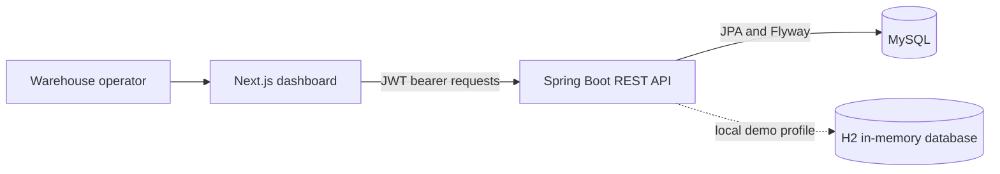

# Stockroom

### Inventory operations, connected end to end.

Stockroom is an inventory management app for warehouse teams. Its Next.js screens connect to a Spring Boot API for product setup, warehouse locations, stock documents, and movement history. Dashboard inventory figures are live API data; the weekly movement chart is illustrative until the API exposes time-series analytics.

<p align="center">
	
	
	
	
	
</p>

## Product Preview


*Dashboard screen. The application also includes login, product catalog, stock operation, ledger, and warehouse setup screens.*

## What You Can Explore

| Screen | What you can do |
| --- | --- |
| **Login page** | Sign in with the local demo administrator using the Login ID and password fields. |
| **Signup page state** | The signup form is available from the login page, but submission is disabled until persistent user accounts are configured. |
| **Overview** | Review live stock-on-hand, inventory value, low-stock, open-document metrics, and replenishment alerts. The weekly chart is illustrative. |
| **Products** | Search by product name or SKU, filter low-stock items, and create products with category, unit, cost, and reorder settings. |
| **Receipts** | Draft incoming stock documents, then validate or cancel drafts. |
| **Deliveries** | Draft outgoing stock documents, then validate or cancel drafts. |
| **Transfers** | Move stock between physical locations with draft, validate, and cancel actions. |
| **Adjustments** | Record stock gains or losses at a physical location and validate or cancel drafts. |
| **Stock ledger** | Search movement history and filter by receipt, delivery, transfer, or adjustment type. |
| **Warehouses & locations** | Create warehouses and their physical storage locations, then review locations by facility. |
| **Workspace controls** | Select the active warehouse, switch light/dark theme, view the signed-in demo identity, or sign out. |

### Demo Flow

1. Sign in as `admin` with password `1234`.
2. Review inventory metrics and low-stock alerts on the dashboard.
3. Set up a warehouse and physical locations, then add products.
4. Draft and validate a receipt, delivery, transfer, or adjustment; review the resulting stock movements in the ledger.

> **Demo scope:** the frontend reads inventory, warehouse, and document data from the Spring API. Weekly movement bars remain illustrative because no analytics endpoint exists yet. The login accepts one hardcoded local demo administrator; see **Demo Login** below. Signup is disabled until database-backed user management is configured.

### Demo Login

Use **Login ID** `admin` and **Password** `1234`. When the backend is reachable, login returns a signed JWT for the demo administrator. When the backend is unavailable, the frontend permits a local-only demo session so the UI can still be explored. This hardcoded credential is temporary and must not be used in a deployed environment. Signup and profile changes are intentionally disabled for this single-user setup.

## How It Fits Together



The codebase is split into a TypeScript frontend and a Java backend. MySQL schema is versioned with Flyway; stock receipts, deliveries, transfers, and adjustments are recorded through a transactional stock ledger. Local demo runs can use the H2 test database.

## Technology

| Layer | Stack |
| --- | --- |
| Web | Next.js 16, React 19, TypeScript |
| UI | Responsive CSS, Lucide icons |
| API | Java 17, Spring Boot 3.5, Spring Web |
| Persistence | Spring Data JPA, Flyway migrations, MySQL |
| Authentication | Spring Security, BCrypt, signed JWT bearer tokens |
| Backend test/demo | Gradle, Spring Boot Test, H2 in-memory database |

## API Coverage

The API uses `/api` as its base path. Responses use a `success` envelope; paginated resources include `items`, `page`, `limit`, `total`, and `total_pages`. Signup and profile edits are intentionally unavailable for the hardcoded demo identity; OTP reset verification requires a persisted user account.

| Module | Endpoints |
| --- | --- |
| Auth | `POST /auth/signup`, `POST /auth/login`, `POST /auth/otp/request`, `POST /auth/otp/verify`, `GET /auth/me`, `PUT /auth/me` |
| Products and categories | Product list/create/get/update/delete, product ledger, category list/create/get |
| Warehouses and locations | Warehouse list/create/get, warehouse location creation, location list/create |
| Stock ledger | `GET /ledger`, `POST /ledger/movement` |
| Receipts, deliveries, transfers, adjustments | For each: list/create/get, validate, cancel |
| Dashboard | `GET /dashboard/summary`, `GET /dashboard/documents` |

For exact methods and request bodies, import [the Postman collection](backend/postman/Stockroom.postman_collection.json). The full module-by-module sequence is documented in [backend/postman/README.md](backend/postman/README.md).

## Run Locally

### Requirements

- Node.js 20.19+ or 22.13+ and npm
- Java 17 or newer; the Gradle wrapper downloads the pinned Gradle distribution
- MySQL for the normal API run, or use the H2-backed demo/test runtime

### Frontend

```powershell
cd frontend
npm install
npm run dev
```

Open [http://localhost:3000](http://localhost:3000).

### Backend

For the normal API run, create a MySQL database named `inventory_management` (or let the connection URL create it automatically), configure credentials, and start the backend:

```powershell
cd backend
.\gradlew.bat bootRun
```

The API listens on port `8080`. Configure a stable JWT signing secret and your local database credentials:

```powershell
$env:DB_URL = "jdbc:mysql://localhost:3306/inventory_management?createDatabaseIfNotExist=true&useSSL=false&allowPublicKeyRetrieval=true&serverTimezone=UTC"
$env:DB_USERNAME = "root"
$env:DB_PASSWORD = "root"
$env:JWT_SECRET = "replace-with-a-random-secret-at-least-32-characters"
.\gradlew.bat bootRun
```

For an isolated local demo that needs no MySQL credentials, run `.\gradlew.bat bootTestRun` from `backend/`. It uses an in-memory H2 database, so inventory data is reset when the API process stops. The built-in administrator has no database user row, so OTP password reset is not available for that account. Configure persistent users and email delivery before enabling signup or password reset.

Check the API health endpoint:

```powershell
Invoke-RestMethod http://localhost:8080/api/health
```

### Postman

Import [Stockroom.postman_collection.json](backend/postman/Stockroom.postman_collection.json) into Postman. Start the backend with `.\gradlew.bat bootTestRun`, then run the collection in order. It signs in as the demo administrator, checks the expected signup/profile restrictions, exercises the inventory API groups, and soft-deletes its demo product.

## Screens and Routes

| Route | Screen or state |
| --- | --- |
| `/login` | Login screen for the built-in demo administrator. |
| `/login` (Sign up view) | Signup form state; registration is disabled until database-backed user setup is available. |
| `/` | Inventory overview and replenishment watch. |
| `/products` | Product catalog, search, low-stock filter, and create-product dialog. |
| `/operations/receipts` | Inbound stock documents. |
| `/operations/deliveries` | Outbound stock documents. |
| `/operations/transfers` | Location-to-location transfer documents. |
| `/operations/adjustments` | Stock gain/loss documents. |
| `/operations/ledger` | Movement history with search and movement-type filter. |
| `/settings/warehouses` | Warehouse and physical location setup. |

## Verify

```powershell
# Frontend production build (from the repository root)
cd frontend
npm run build

# Backend context test (from the backend directory)
cd ..\backend
.\gradlew.bat test
```

## Project Layout

```text
Inventory-Management/
├── frontend/
│   ├── public/                 # Dashboard screenshot and static assets
│   └── src/
│       ├── app/                # Next.js routes and global styles
│       ├── components/         # Dashboard, catalog, operations, ledger, and settings screens
│       ├── services/           # API client boundary
│       ├── store/              # Shared client state
│       └── utils/              # Frontend helpers
└── backend/
	├── postman/                # Importable collection and local environment
	└── src/
		├── main/java/com/stockroom/
		│   ├── config/
		│   ├── controller/
		│   ├── dto/
		│   ├── exception/
		│   ├── model/
		│   ├── repository/
		│   └── service/
		├── main/resources/      # application.yaml and Flyway migrations
		└── test/                # Spring context test and H2 settings
```

## Next Up

- Configure persistent user accounts and email delivery before enabling signup and password reset.
- Add role-based permissions beyond the current authenticated-request boundary.
- Add automated workflow tests to the Gradle suite so the full Postman scenarios run in CI.