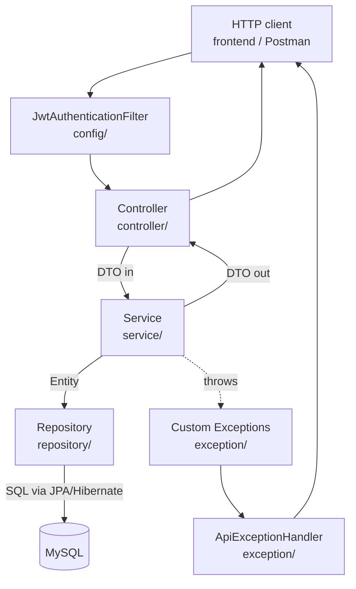

# Backend Code Structure — A Roadmap

This backend follows the classic **layered (N-tier) architecture** used by almost every Spring
Boot REST API. Each package has exactly one job. A request flows top-to-bottom through the
layers, and a response flows back up. This doc walks through each layer using real classes from
`src/main/java/com/stockroom/`.

## The Big Picture



**Rule of thumb:** requests move **down** (client → controller → service → repository → DB), and
data moves **up** in a different shape at each step (JSON → DTO → Entity → SQL row, and back).
Controllers and repositories never talk to each other directly — everything routes through the
service layer.

---

## `config/` — Framework wiring, no business logic

Holds Spring configuration classes: security rules, filters, CORS, beans. Nothing here knows
about "products" or "stock" — it's plumbing that applies to the whole app.

- [`SecurityConfig.java`](src/main/java/com/stockroom/config/SecurityConfig.java) — defines the
  `SecurityFilterChain` bean: which endpoints are public (`/api/health`, `/api/auth/login`, etc.)
  vs. require a JWT, CORS allowed origins, and the `PasswordEncoder` bean (BCrypt).
- [`JwtAuthenticationFilter.java`](src/main/java/com/stockroom/config/JwtAuthenticationFilter.java) —
  a servlet filter that runs on **every** request before it reaches a controller. It reads the
  `Authorization: Bearer <token>` header, validates the JWT, and if valid, populates
  `SecurityContextHolder` so the rest of the request is treated as "authenticated".

Think of `config/` as: *"How does a raw HTTP request become an authenticated, CORS-safe request
before any of my code runs?"*

---

## `controller/` — The HTTP boundary

Controllers are the **only** classes annotated `@RestController`. Their job is narrow and
mechanical:

1. Declare the URL route (`@RequestMapping`, `@GetMapping`, etc.)
2. Parse/validate the incoming request (path variables, query params, `@RequestBody` + `@Valid`)
3. Call **one** service method
4. Wrap the result in the standard `ApiResponse` envelope and pick an HTTP status

Controllers should contain **no business logic** — no calculations, no direct database access, no
validation beyond "is this JSON well-formed". Example from
[`ProductController.java`](src/main/java/com/stockroom/controller/ProductController.java):

```java
@PostMapping
public ResponseEntity<ApiResponse<ProductResponseDto>> create(@Valid @RequestBody ProductRequestDto request) {
    return ResponseEntity.status(HttpStatus.CREATED).body(ApiResponse.ok(products.create(request)));
}
```

All it does is delegate to `ProductService.create(...)`. Even the `sort_by` → JPA property
mapping in `list(...)` is just translating an HTTP query param name to a real field name — still
"HTTP glue", not business logic.

One controller per resource: `ProductController`, `WarehouseController`, `StockLedgerController`,
`InventoryDocumentController`, `CategoryController`, `AuthController`, `DashboardController`,
`HealthController`.

---

## `dto/` — Data Transfer Objects (the "shape" of the API)

DTOs define exactly what JSON goes **in** and **out** of the API — decoupled from how data is
stored in the database. This project uses Java `record`s, which are perfect for DTOs (immutable,
auto-generated `equals`/`hashCode`/accessors).

Two kinds:

- **Request DTOs** (e.g. `ProductRequestDto`) — carry validation annotations
  (`@NotBlank`, `@PositiveOrZero`, `@DecimalMin`) so bad input is rejected *before* it reaches the
  service layer. `@JsonProperty("category_id")` maps the incoming `snake_case` JSON key to a
  `camelCase` Java field.
- **Response DTOs** (e.g. `ProductResponseDto`) — control exactly what's returned to the client.
  This matters because an `Entity` (like `Product`) is a database mapping and often has
  relationships (`Category category`) you don't want serialized directly (risk of infinite loops,
  leaking internal fields, or over-fetching). The service manually builds the response DTO from
  the entity.
- `ApiResponse<T>` / `PagedResponse<T>` — generic wrapper types used by **every** endpoint so all
  responses have a consistent envelope (`{ "success": true, "data": ... }`, plus paging metadata).

**Why not just return the entity?** Separating DTOs from entities means you can change your
database schema without breaking the API contract, and vice versa.

---

## `model/` — JPA Entities (the database mapping)

Entities are classes annotated `@Entity` that map 1:1 to database tables (see
[`db/migration/V1__inventory_schema.sql`](src/main/resources/db/migration/V1__inventory_schema.sql)).
Example, [`Product.java`](src/main/java/com/stockroom/model/Product.java):

```java
@Entity
@Table(name = "products")
public class Product {
    @Id @GeneratedValue(strategy = GenerationType.IDENTITY)
    private Long id;

    @Column(nullable = false, unique = true, length = 80)
    private String sku;

    @ManyToOne(fetch = FetchType.LAZY)
    @JoinColumn(name = "category_id")
    private Category category;
    ...
}
```

`@Column` maps a field to a table column, `@ManyToOne`/`@JoinColumn` maps a foreign key
relationship to a Java object reference (so `product.getCategory().getName()` triggers a lazy SQL
fetch under the hood). Lombok's `@Getter`/`@Setter` avoid hand-written boilerplate.

Entities in this codebase: `Product`, `Category`, `Warehouse`, `Location`, `Stock`,
`StockLedger`, `InventoryDocument`, `InventoryDocumentLine`, `InventoryUser`, `PasswordResetOtp`,
plus enums `DocumentType`, `DocumentStatus`, `MovementType`.

**Entities never leave the service layer.** Controllers deal only in DTOs; only services and
repositories touch entities.

---

## `repository/` — Data access (talks to the database)

Repositories are interfaces that extend Spring Data's `JpaRepository<Entity, IdType>`. You get
CRUD (`save`, `findById`, `delete`, ...) for free, and you declare extra queries just by naming a
method or writing JPQL:

```java
public interface ProductRepository extends JpaRepository<Product, Long> {
    // Derived query — Spring generates the SQL from the method name
    boolean existsBySkuIgnoreCaseAndDeletedAtIsNull(String sku);

    // Explicit JPQL for anything a method name can't express
    @Query("""
        select p from Product p
        where p.deletedAt is null
          and (:categoryId is null or p.category.id = :categoryId)
          and (:search is null or lower(p.name) like lower(concat('%', :search, '%')) ...)
    """)
    Page<Product> searchProducts(@Param("search") String search, @Param("categoryId") Long categoryId, Pageable pageable);

    @Lock(LockModeType.PESSIMISTIC_WRITE)
    Optional<Product> findActiveByIdForUpdate(@Param("id") Long id);
}
```

No SQL string concatenation, no manual `Connection`/`ResultSet` handling — Spring Data JPA +
Hibernate generate the SQL and map rows back to entities. `@Lock(PESSIMISTIC_WRITE)` is used where
concurrent stock updates must not race (e.g. applying a stock movement).

**Repositories contain no business rules** — only data-access queries.

---

## `service/` — Business logic (the brain of the app)

This is where the actual rules live: validation beyond simple field checks, orchestrating
multiple repositories, transactions, and converting between entities and DTOs. Every public method
is usually wrapped in `@Transactional` (read-write) or `@Transactional(readOnly = true)` (queries),
so a failure partway through rolls back all database changes in that method.

From [`ProductService.java`](src/main/java/com/stockroom/service/ProductService.java):

```java
@Transactional
public ProductResponseDto create(ProductRequestDto request) {
    String sku = request.sku().trim();
    if (products.existsBySkuIgnoreCaseAndDeletedAtIsNull(sku)) {
        throw new ConflictException("Product SKU already exists: " + sku);   // business rule
    }
    Product product = new Product();
    apply(product, request);                 // DTO -> entity
    product.setCreatedAt(LocalDateTime.now());
    return toResponse(products.save(product), BigDecimal.ZERO, List.of());   // entity -> DTO
}
```

A service:
1. Receives a request DTO from the controller
2. Applies validation/business rules (uniqueness, stock availability, status transitions...)
3. Loads/mutates entities via one or more repositories
4. Converts the result entity back into a response DTO
5. Throws a domain exception (`ConflictException`, `ResourceNotFoundException`,
   `InsufficientStockException`) if something's wrong

Services in this codebase: `ProductService`, `CategoryService`, `WarehouseService`,
`StockLedgerService`, `InventoryDocumentService`, `AuthService`, `JwtService`,
`InventoryUserDetailsService`, `DashboardService`.

`StockLedgerService`/`InventoryDocumentService` are good examples of "orchestration" — creating a
receipt/delivery/transfer touches `Product`, `Location`, `Stock`, and `StockLedger` in one
transaction.

---

## `exception/` — Domain errors + centralized handling

- **Custom exceptions** (`ResourceNotFoundException`, `ConflictException`,
  `InsufficientStockException`) — thrown by services when a business rule is violated. They
  extend `RuntimeException` so they don't need to be declared/caught everywhere (unchecked).
- **`ApiExceptionHandler`** — annotated `@RestControllerAdvice`, a single class that intercepts
  exceptions thrown by *any* controller/service and converts them into the right HTTP status +
  `ApiResponse.error(...)` body:

```java
@ExceptionHandler(ResourceNotFoundException.class)
public ResponseEntity<ApiResponse<Void>> notFound(ResourceNotFoundException exception) {
    return ResponseEntity.status(HttpStatus.NOT_FOUND).body(ApiResponse.error(exception.getMessage()));
}
```

This means controllers never write `try/catch` blocks — just throw a meaningful exception from the
service, and it's automatically turned into the correct JSON error response and status code
(404, 409, 400, 401...).

---

## Putting It All Together: One Request, Start to Finish

**`POST /api/products`** with a new product's JSON body:

1. **`JwtAuthenticationFilter`** (config) checks the `Authorization` header, marks the request
   authenticated.
2. **`SecurityConfig`** rules confirm this route requires authentication (it's not in the public
   allow-list) — request proceeds.
3. **`ProductController.create(...)`** (controller) receives the JSON, Spring converts it to a
   `ProductRequestDto` and validates `@NotBlank`/`@DecimalMin` etc. If invalid,
   `MethodArgumentNotValidException` is thrown immediately — never reaches the service.
4. **`ProductService.create(...)`** (service) checks SKU uniqueness via
   `ProductRepository.existsBySkuIgnoreCaseAndDeletedAtIsNull` (repository → DB). If it exists,
   throws `ConflictException`.
5. If unique, builds a `Product` **entity** (model), sets fields, calls
   `products.save(product)` (repository → Hibernate generates `INSERT` → MySQL).
6. Service converts the saved entity back into a `ProductResponseDto` (dto).
7. Controller wraps it: `ResponseEntity.status(201).body(ApiResponse.ok(dto))`.
8. If step 4 threw `ConflictException`, **`ApiExceptionHandler`** (exception) catches it and
   returns `409 Conflict` with a JSON error body instead.

## Why Split It Up This Way?

- **Single Responsibility** — each class has one reason to change (a new validation rule only
  touches the service; a new column only touches the entity + DTO + migration).
- **Testability** — you can unit-test `ProductService` with a mocked `ProductRepository`, no HTTP
  or database needed.
- **Swappable layers** — you can change the database (this project just migrated
  PostgreSQL → MySQL) without touching controllers/services at all, because repositories/entities
  isolate persistence details.
- **Consistent conventions** — because *every* Spring Boot project uses this same shape
  (controller/service/repository/model/dto/exception/config), any engineer familiar with Spring
  can navigate this codebase without a tour.

## Where to Look for What

| I want to... | Look in |
| --- | --- |
| Add/change a URL route or request/response shape | `controller/`, `dto/` |
| Add/change a business rule or validation | `service/` |
| Add/change a database table or column | `model/`, `src/main/resources/db/migration/` |
| Write a new database query | `repository/` |
| Add a new kind of error response | `exception/` |
| Change security rules, CORS, or JWT handling | `config/` |
| Change datasource, JPA, logging, or app-wide settings | `src/main/resources/application.yaml` |
